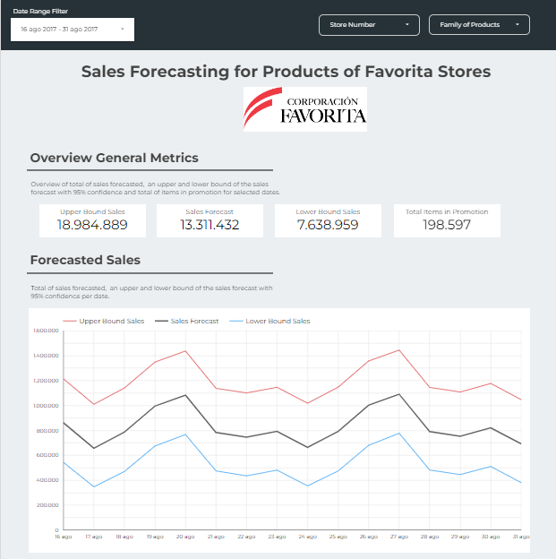
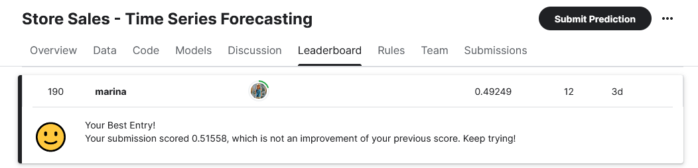

# A real-life example of a forecasting problem with business-minded aspects: estimating the sales of a supermarket chain

The purpose of this project is to deal with a **real world forecasting problem** and approach it with a **business concern**: from explaining the insights we can get just from the data, find a ML model that would fit on the forecasting problem and finally put into production the model and the insights we can get from it.

For this project I've chosen [this](https://www.kaggle.com/competitions/store-sales-time-series-forecasting/overview) Kaggle dataset. This dataset contains information about the sales of multiple stores of the company Favorita, in Ecuador. The goal of this project is to find a model that able to **predict the estimation of sales** for each family group of products and stores. Predicting the sales of an element (in this case a product) gives to any business and important and powerful information to take advantage on. In the case of the stores, one of these huge advantages could be able to **estimate future revenue**, **allocate resources more effectively**, etc. [Here](https://www.getweflow.com/blog/importance-of-sales-forecasting) for more information.

So, in the following sections we will put ourselves in the shoes of a real store company, which want to understand which useful insights we can get from their historical data, train a model able to predict the future amount of sales and take advantage of this to increase the turnover.

Final results are presented in a user friendly [report](https://lookerstudio.google.com/reporting/a787fb72-8e31-49d8-978a-c9ee525fda36):

  

  

The results of the best model found in [this project]() have been submitted to the [Kaggle competition](https://www.kaggle.com/competitions/store-sales-time-series-forecasting/leaderboard)
 and currently the rating of the results is among the top 26% (190th position out of 726):

Click [here](https://nbviewer.org/github/MarinaMoreno/Forecasting-sales/blob/main/Forecast%20sales.ipynb) to properly visualize the internal links of the Jupiter notebook.

